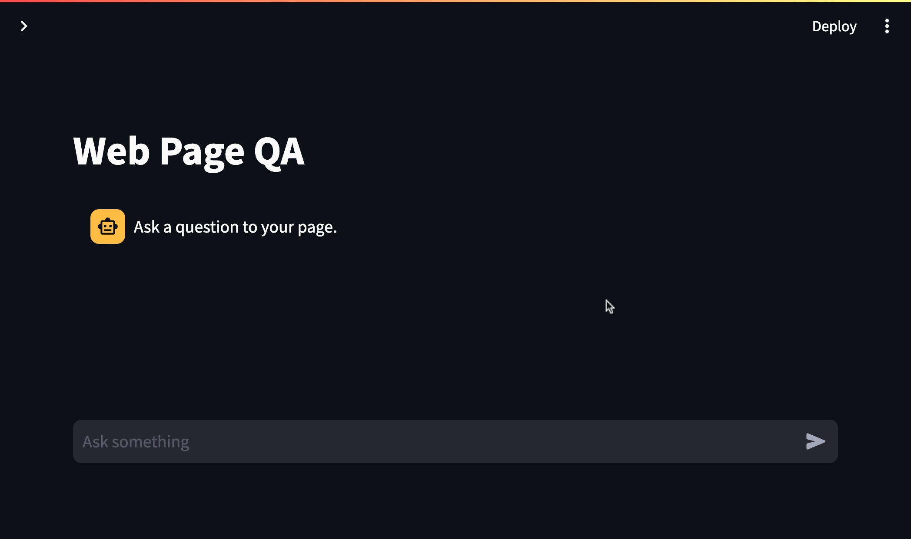

# rag-qa

[](https://github.com/ruankie/rag-qa/stargazers)
[](https://github.com/ruankie/rag-qa/commits/main)

## Description

RAG-QA is a free, containerised question-answer framework that allows you to ask questions to your documents in an intuitive way.

This app uses a method called retrieval augmented generation (RAG) to retrieve information that is relevant to your question from your uploaded document. It then uses a large language model (LLM) to answer the question with the retrieved context.

The current implementation uses the following components:

- **LLM:** [Google Gemini Pro](https://ai.google.dev/)
- **Embedding Model:** [all-MiniLM-L6-v2](https://huggingface.co/sentence-transformers/all-MiniLM-L6-v2)
- **Vector Database:** [Chroma DB](https://www.trychroma.com/)
- **Frontend:** [Streamlit](https://streamlit.io/)
- **Backend:** [FastAPI](https://fastapi.tiangolo.com/)

## Demo

> This demo shows the app answering a question related to Alphabet Inc's Q3 financial result from 2023. Notice the app frontend is shown on the left; the logs are shown on the upper right; the PDF report is shown on the bottom left.



## Usage

> Note: The first time you run this, it might take a while to build all the images and download the embedding models.

1. You will need an API key from OpenAI or Google. You can create one for free here:
    - [Google](https://ai.google.dev/) - to use models like Gemini (Recommended since it's free)
    - [OpenIA](https://platform.openai.com/account/api-keys) - to use models like GPT4
2. Set up your API keys in a file called `.env` (see `.env.example` for an example)

3. Now set up the backend and frontend

    ```shell
    docker compose up
    ```

4. Navigate to the frontend in your browser: [http://localhost:8501/](http://localhost:8501/)
5. Upload a PDF document that you would like to ask a question about
6. Ask a question in the chat input section and wait for a response

## Development

1. (Optional) [Download](https://asdf-vm.com/guide/getting-started.html#_2-download-asdf) and [install](https://asdf-vm.com/guide/getting-started.html#_3-install-asdf) [asdf](https://asdf-vm.com/) on your machine to manage the version of Python and Poetry used in this project. Once done, run `asdf install` to install the versions specified in `.tool-versions`. Alternatively, install them manually as described below:
2. [Install Poetry](https://python-poetry.org/docs/#installation) on your machine
3. [Install Python 3](https://www.python.org/downloads/) on your machine
4. Create a virtual environment for your project using the command `poetry install`. This will install all the basic dependencies specified in your `pyproject.toml` file.
5. Set up your API keys in a file called `.env` (see `.env.example` for an example)
6. When you run your backend and frontend containers locally, use `docker compose up --build` to ensure the latest changes are reflected in the containers.
